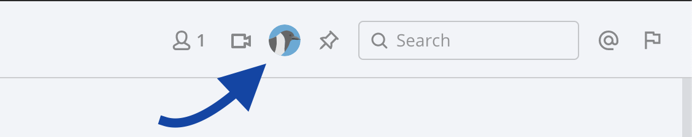

# Introduction

Channel header buttons provide a convenient way to trigger action. But once registered, they show up in all channels, all the time. Depending on the use-case, we may not want to show them all the time and in all the channels. There's a neat little trick we can use to show or hide the button.



# Button Component

We'll consider a bare minimum channel header button component. Nothing fancy, with a simple render function returning an SVG image wrapped inside a span.

```JSX
class ChannelHeaderButtonIcon extends React.Component {
    constructor(props) {
        super(props);
        this.state = this.getInitialState();
    }
    
    getInitialState = () => {
        return {
            // ... some state params
        };
    };
    
    render() {
        return (
            <span
                className={'raven-icon'}
                dangerouslySetInnerHTML={{
                    __html: logo,
                }}
            />
        );
    }
}
```

# Adding Refs

The way we'll be hiding this button is by adding a `hidden` class to the button's wrapper. By wrapper, we don't mean the `span` we have in out component, but rather the wrapper Mattermost webapp adds to all plugin channel header buttons.

To access this wrapper inside out React component, we'll add refs to it and navigate our way above in DOM hierarchy.


## Parent ref placeholder in state

Add parent ref placeholder in component's state-

```JSX
getInitialState = () => {
  return {
      // ... some state params
      parent: undefined,
  };
};
```

## Get parent element ref

Add ref to wrapper `span` in render method-

```JSX
render() {
    return (
        <span
            ref={this.handleRef}
            className={'raven-icon'}
            dangerouslySetInnerHTML={{
                __html: logo,
            }}
        />
    );
}
```

Get parent ref from `span`-

```JSX
handleRef = (ref) => {
    if (ref) {
        this.setState({
            parent: ref.parentNode,
        });
    }
}
```

`ref.parentNode` gives us the parent element.

## Show or hide the button

Now we can use any condition we like to add or remove `hidden` class to the parent to show or hide it. We'll do this in the `render()` method.

```JSX
render() {
    if (this.state.parent) {
        if (<some condition>) {
            // if true, hide the element
            this.state.parent.classList.remove('hidden');
        } else {
            // else display it
            this.state.parent.classList.add('hidden');
        }
    }

    return (
        <span
            ref={this.handleRef}
            className={'raven-icon'}
            dangerouslySetInnerHTML={{
                __html: logo,
            }}
        />
    );
}
```

To toggle the button in specific channels we can receive the current channel ID as props and use it in our condition. Mattermost already include the current channel in the action handler for channel header buttons.

# Handling the case of plugin dropdown menu

When registering more than five channel header buttons (all plugins combined), Mattermost combines them all into a single dropdown menu. In this case the parent node we're interested in changes.

## Finding the right parent node.

We can navigate the DOM and check for the presence of certain classes in one of the parent nodes to detect if we're in dropdown mode. Based on this we have two different parent nodes we want to alter.

```JSX
getIconParentToHide = () => {
    if (this.isChannelHeaderButtonInDropdown()) {
        return this.state.parent.parentNode.parentNode;
    }
    return this.state.parent;
}


isChannelHeaderButtonInDropdown = () => {
    const classList = this.state.parent.parentNode.parentNode.parentNode.parentNode.classList;
    return classList.contains('dropdown') && classList.contains('btn-group');
}
```

Now instead of changing classes on `this.state.parent`, we do it on the DOM node returned by `getIconParentToHide()`-

```JSX
render() {
    if (this.state.parent) {
        const targetParent = this.getIconParentToHide();
        if (<some condition>) {
            // if true, hide the element
            targetParent.classList.remove('hidden');
        } else {
            // else display it
            targetParent.classList.add('hidden');
        }
    }

    return (
        <span
            ref={this.handleRef}
            className={'raven-icon'}
            dangerouslySetInnerHTML={{
                __html: logo,
            }}
        />
    );
}
```

# Conclusion

By finding the right parent DOM node and adding `hidden` class to it, we can show or hide the registed channel header buttons. The approach may look flaky but works perfectly well. [Standup Raven](https://github.com/standup-raven/standup-raven) has been using it for last few months and it's working perfectly in all Mattermost versions released so far.

